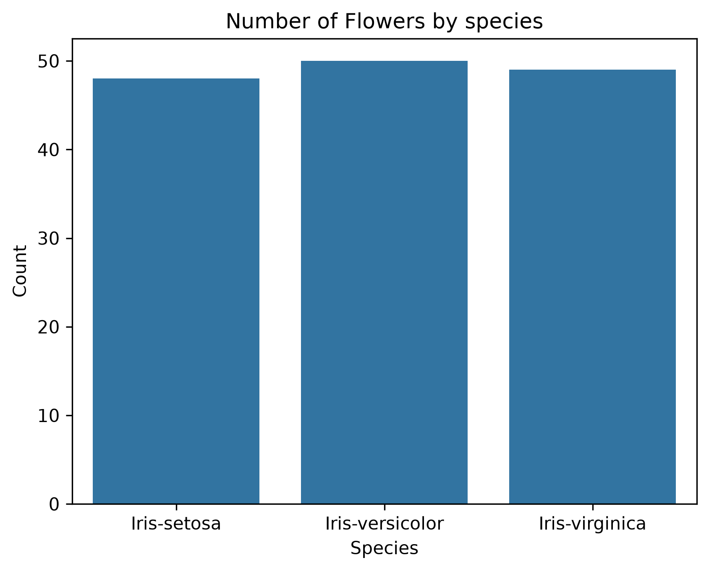
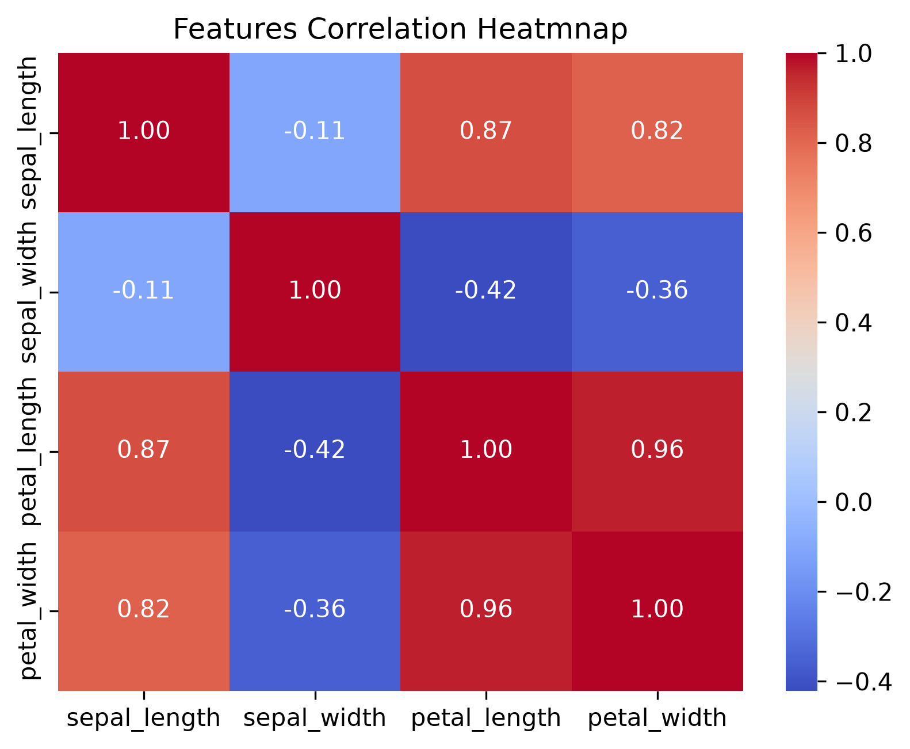
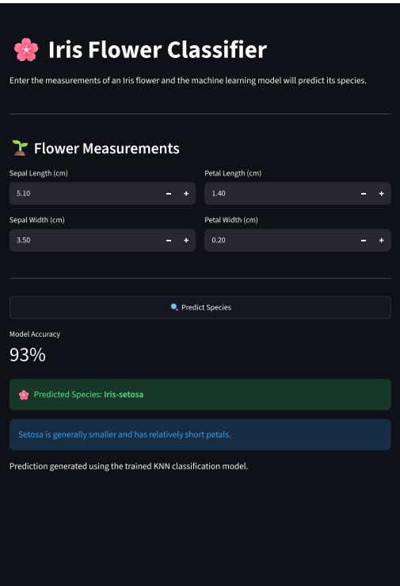

# 🌸 Iris Flower Classification

> A machine learning classification project that predicts the species of an Iris flower from its sepal and petal measurements, powered by K-Nearest Neighbors and served through an interactive Streamlit app.


---

## 📌 Project Overview

This project classifies Iris flowers into one of three species using four simple physical measurements:

| Species | Sepal Length | Sepal Width | Petal Length | Petal Width |
|---|:---:|:---:|:---:|:---:|
| 🌱 Iris-setosa | ✅ | ✅ | ✅ | ✅ |
| 🌿 Iris-versicolor | ✅ | ✅ | ✅ | ✅ |
| 🌳 Iris-virginica | ✅ | ✅ | ✅ | ✅ |

Users enter these four measurements into a **Streamlit web app** and receive an instant predicted species from the trained model.

---

## 🧠 Machine Learning Approach

### Algorithm — K-Nearest Neighbors (KNN)

```python
KNeighborsClassifier(n_neighbors=5)
```

Multiple values of `k` were tested to find the best-performing neighborhood size:

| k | Accuracy |
|:---:|---:|
| 1 | 93% |
| 3 | 93% |
| **5** | **93%** |
| 7 | 93% |
| 9 | 90% |
| 11 | 90% |

`k=5` was selected as the final model — a good balance between accuracy and generalization.

---

## 📊 Model Performance

The final KNN model achieved the following classification report on the test set:

| Species | Precision | Recall | F1-Score |
|---|---:|---:|---:|
| Iris-setosa | 1.00 | 1.00 | 1.00 |
| Iris-versicolor | 0.90 | 0.90 | 0.90 |
| Iris-virginica | 0.89 | 0.89 | 0.89 |

**Iris-setosa** is classified perfectly, since it's linearly separable from the other two species. **Versicolor** and **virginica** show a small amount of overlap, which is reflected in their slightly lower precision/recall.

---

## 📈 Exploratory Data Analysis

The dataset was explored using:

- Count plots
- Pair plots
- Correlation heatmap
- Descriptive statistics
- Missing-value analysis
- Duplicate-value detection

### Class Distribution

The dataset is well balanced across all three species (~50 samples each):

<p align="center">
  
</p>

### Feature Correlation

Petal length and petal width are very strongly correlated (0.96), making them the most predictive features for species classification:

<p align="center">
  
</p>

### Pairwise Feature Relationships

> 💡 The pair plot shows that the three species form clearly distinguishable clusters especially by petal length and petal width  with a small amount of overlap between *Iris-versicolor* and *Iris-virginica*, consistent with the model's performance above.

<p align="center">
  
</p>

---

## 🧹 Data Preprocessing

1. Loaded the Iris dataset
2. Inspected the dataset structure
3. Checked for missing values
4. Detected and removed duplicate rows
5. Separated features and target
6. Split the dataset into training and testing sets

**Features:** `sepal_length`, `sepal_width`, `petal_length`, `petal_width`
**Target:** `species`

---

## 🌐 Streamlit Application

The project includes an interactive **Streamlit** app where users can input flower measurements and get a live prediction.

<p align="center">
  
</p>

**Application Flow**

```
User Input
    ↓
Flower Measurements
    ↓
Trained KNN Model
    ↓
Species Prediction
    ↓
Iris-setosa / Iris-versicolor / Iris-virginica
```

---

## 📁 Project Structure

```
iris-flower-classification/
│
├── app.py               # Streamlit application
├── best_model.pkl        # Trained KNN model
├── IRIS.csv               # Dataset
├── requirements.txt      # Project dependencies
├── README.md              # Project documentation
├── .gitignore
└── assets/                # README screenshots
    ├── app.png
    ├── countplot.png
    ├── heatmap.png
    └── pairplot.png
```

---

## ⚙️ Installation

### 1. Clone the repository
```bash
git clone https://github.com/Abdullah12-svg/iris-flower-classification.git
cd iris-flower-classification
```

### 2. Create a virtual environment
```bash
python -m venv venv
```

### 3. Activate it

**Windows**
```bash
venv\Scripts\activate
```

**macOS/Linux**
```bash
source venv/bin/activate
```

### 4. Install dependencies
```bash
pip install -r requirements.txt
```

---

## ▶️ Run the Application

```bash
streamlit run app.py
```

The app will automatically open in your default browser.

---

## 🛠️ Technologies Used

- **Language:** Python
- **Data Handling:** Pandas, NumPy
- **Visualization:** Matplotlib, Seaborn
- **Machine Learning:** Scikit-learn (KNeighborsClassifier)
- **Model Persistence:** Joblib
- **Web App:** Streamlit
- **Development:** Jupyter Notebook

---

## 🎯 Learning Outcomes

Through this project, I practiced:

- Classification problems & K-Nearest Neighbors
- Train/test splitting
- Model evaluation (accuracy, precision, recall, F1-score)
- Exploratory data analysis
- Data cleaning and preprocessing
- Model serialization with Joblib
- Building and deploying a Streamlit application

---

## 🔮 Future Improvements

- [ ] Test additional classification algorithms (SVM, Random Forest, Logistic Regression)
- [ ] Hyperparameter tuning with GridSearchCV
- [ ] Add confusion matrix visualization
- [ ] Improve the Streamlit UI/UX
- [ ] Deploy the application online (Streamlit Community Cloud)
- [ ] Add more advanced model evaluation (ROC curves, cross-validation)

---

## 👤 Author

**Abdullah Zaheer**
BS Software Engineering, Capital University of Science and Technology (CUST)
AI Intern @ PK Teams | ML → LangChain, LangGraph, RAG & FastAPI

- GitHub: [@Abdullah12-svg](https://github.com/Abdullah12-svg)

---

## ⭐ Support

If you found this project useful, consider giving it a ⭐ — it helps a lot and keeps me motivated to build more!
